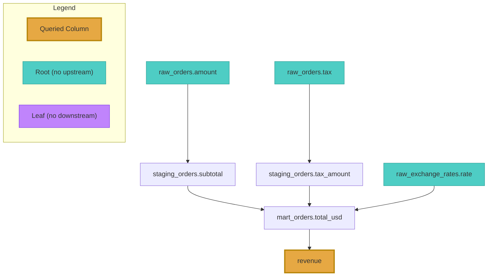

# Graph-Based Lineage

SQL Glider's graph feature lets you build, merge, and query column-level lineage across multiple SQL files. This is the key feature for understanding data flow at scale — across an entire SQL codebase rather than a single query.

## Why Graph Lineage?

The basic `sqlglider lineage` command analyzes one SQL file at a time. That works for understanding a single query, but real data pipelines span many files: staging tables feed into dimensions, dimensions feed into reports, and so on.

The graph commands connect the dots across files, so you can answer questions like:

- "What raw sources ultimately feed into this report column?"
- "If I change this column in the staging table, what downstream reports break?"

## Tutorial: Your First Lineage Graph

This walkthrough uses a simple three-file pipeline to demonstrate the full workflow.

### Step 1: Set Up Example SQL Files

Create a `queries/` directory with three files representing a typical data pipeline:

**`queries/customers.sql`** — Staging layer

```sql
-- Customer dimension table
SELECT
    customer_id,
    customer_name,
    email,
    created_at
FROM raw_customers;
```

**`queries/orders.sql`** — Staging layer

```sql
-- Orders fact table
SELECT
    order_id,
    customer_id,
    order_total,
    order_date,
    status
FROM raw_orders;
```

**`queries/reports.sql`** — Reporting layer (joins the two staging tables)

```sql
-- Customer orders summary report
SELECT
    c.customer_name,
    c.email,
    COUNT(o.order_id) AS total_orders,
    SUM(o.order_total) AS total_spent,
    MAX(o.order_date) AS last_order_date
FROM customers c
JOIN orders o ON c.customer_id = o.customer_id
GROUP BY c.customer_name, c.email;
```

### Step 2: Build the Graph

Build a lineage graph from the entire directory:

```bash
sqlglider graph build queries/ -o graph.json
```

This recursively scans `queries/` for `.sql` files, parses each one, and writes the combined lineage graph to `graph.json`.

!!! tip "Useful build options"

    ```bash
    # Non-recursive (current directory only)
    sqlglider graph build queries/ -o graph.json --no-recursive

    # Custom file pattern
    sqlglider graph build queries/ -g "*.spark.sql" -o graph.json

    # Specific dialect
    sqlglider graph build queries/ -o graph.json --dialect postgres
    ```

### Step 3: Query Upstream Lineage

Find out where a report column gets its data from:

```bash
sqlglider graph query graph.json --upstream total_spent
```

**Example output:**

```
                              Sources for 'total_spent'
+---------------------------------------------------------------------------------------------+
| Column      | Table  | Hops | Root | Leaf | Paths                             | File        |
|-------------+--------+------+------+------+-----------------------------------+-------------|
| order_total | orders |    1 |  Y   |  N   | orders.order_total -> total_spent | reports.sql |
+---------------------------------------------------------------------------------------------+

Total: 1 column(s)
```

Here's how to read each column:

| Field  | Description                                          |
|--------|------------------------------------------------------|
| Column | The source column name                               |
| Table  | The table that column belongs to                     |
| Hops   | How many steps away from the queried column (1 = direct source) |
| Root   | `Y` if this is an ultimate source with no further upstream dependencies |
| Leaf   | `Y` if this is a final output with no further downstream consumers |
| Paths  | The full data flow path, read left to right with `->` separating each step |
| File   | Which SQL file defines this relationship             |

In this example, `total_spent` has one source: `orders.order_total` from `reports.sql`. It's 1 hop away, and it's a **root** node (`Y`) meaning `orders.order_total` is an ultimate source — there's nothing further upstream in this graph. It's not a **leaf** (`N`) because it feeds into `total_spent`.

### Step 4: Query Downstream Lineage

Now ask the reverse question — if `orders.order_total` changes, what's affected?

```bash
sqlglider graph query graph.json --downstream orders.order_total
```

**Example output:**

```
                          Affected Columns for 'orders.order_total'
+--------------------------------------------------------------------------------------------+
| Column      | Table | Hops | Root | Leaf | Paths                             | File        |
|-------------+-------+------+------+------+-----------------------------------+-------------|
| total_spent |       |    1 |  N   |  Y   | orders.order_total -> total_spent | reports.sql |
+--------------------------------------------------------------------------------------------+

Total: 1 column(s)
```

This tells you that changing `orders.order_total` would impact `total_spent`, which is a **leaf** node (`Y`) — a final output with no further downstream consumers.

!!! note "Impact analysis"

    Downstream queries are the foundation of impact analysis. Before changing a source column, run a downstream query to understand the blast radius.

### Step 5: Export Results

Query results support multiple output formats:

```bash
# JSON for programmatic use
sqlglider graph query graph.json --upstream total_spent -f json

# CSV for spreadsheets
sqlglider graph query graph.json --upstream total_spent -f csv
```

### Example: Upstream Lineage in JSON

JSON output is especially useful when you want to feed lineage data into other tools — CI checks, data catalogs, documentation generators, or custom dashboards. Here's what the upstream query for `total_spent` looks like in JSON:

```bash
sqlglider graph query graph.json --upstream total_spent -f json
```

```json
{
  "query_column": "total_spent",
  "direction": "upstream",
  "count": 1,
  "columns": [
    {
      "identifier": "orders.order_total",
      "file_path": "queries/reports.sql",
      "query_index": 0,
      "schema_name": null,
      "table": "orders",
      "column": "order_total",
      "hops": 1,
      "output_column": "total_spent",
      "is_root": true,
      "is_leaf": false,
      "paths": [
        ["orders.order_total", "total_spent"]
      ]
    }
  ]
}
```

Each entry in `columns` tells you:

| Field | Description |
|-------|-------------|
| `identifier` | Fully qualified source column (`table.column`) |
| `file_path` | The SQL file that defines this relationship |
| `query_index` | Which query in the file (0-based, for multi-statement files) |
| `table` / `column` | Parsed components of the identifier |
| `hops` | Distance from the queried column (1 = direct source) |
| `is_root` | `true` if this column has no further upstream sources |
| `is_leaf` | `true` if this column has no downstream consumers |
| `paths` | Every path from this source to the queried column, as ordered node lists |

!!! tip "Tracing lineage across files"

    The `file_path` field is particularly valuable in large graphs spanning dozens or hundreds of SQL files. It tells you exactly which file defines each relationship, so you can trace a column's journey across your entire pipeline — from raw ingestion scripts through staging layers to final reports — without having to search through files manually.

!!! tip "Using JSON output in CI"

    JSON output pairs well with tools like `jq` for scripted checks. For example, to list all root source tables feeding a report column:

    ```bash
    sqlglider graph query graph.json --upstream total_spent -f json \
      | jq -r '.columns[] | select(.is_root) | .table'
    ```

## Visualizing Lineage

SQL Glider can generate diagrams from lineage graphs in [Mermaid](https://mermaid.js.org/) and [DOT (Graphviz)](https://graphviz.org/doc/info/lang.html) formats. These are text-based diagram languages that render in many tools — Mermaid works natively in GitHub Markdown, GitLab, Notion, and more; DOT can be rendered with Graphviz into SVG, PNG, or PDF.

### Visualize an Entire Graph

The `graph visualize` command renders every node and edge in a graph file:

```bash
# Mermaid (default)
sqlglider graph visualize graph.json

# DOT (Graphviz)
sqlglider graph visualize graph.json -f dot

# Save to file
sqlglider graph visualize graph.json -o lineage.mmd
sqlglider graph visualize graph.json -f dot -o lineage.dot
```

### Diagram Output from Queries

The `graph query` command also supports diagram formats. This is useful for visualizing just the upstream or downstream subgraph for a specific column:

```bash
# Mermaid diagram of upstream sources
sqlglider graph query graph.json --upstream total_spent -f mermaid

# DOT diagram of downstream impact
sqlglider graph query graph.json --downstream orders.order_total -f dot
```

Query diagrams include color-coded nodes and a legend:

| Color  | Meaning |
|--------|---------|
| Amber  | The queried column |
| Teal   | Root node (no upstream dependencies) |
| Violet | Leaf node (no downstream consumers) |

**Example:** Imagine a pipeline where a `revenue` report column draws from multiple sources through several transformation layers. Querying `--upstream revenue` would produce a diagram like this:



The amber node is the column you queried (`revenue`), teal nodes are ultimate root sources with no further upstream dependencies (`raw_orders.amount`, `raw_orders.tax`, `raw_exchange_rates.rate`), and intermediate nodes (`staging_orders.*`, `mart_orders.*`) appear in the default style. The legend is included automatically.

### Mermaid Markdown Format

The `mermaid-markdown` format wraps the diagram in a fenced code block, ready to paste directly into a `.md` file:

```bash
# Output a markdown-ready Mermaid block
sqlglider graph query graph.json --upstream total_spent -f mermaid-markdown

# Works with visualize too
sqlglider graph visualize graph.json -f mermaid-markdown -o lineage.md
```

This produces output with the `` ```mermaid `` fence included, so the diagram renders automatically when viewed in GitHub, GitLab, or any markdown tool with Mermaid support.

### Rendering Diagrams

**Mermaid:**

- Paste into any GitHub Markdown file or issue — it renders automatically
- Use the [Mermaid Live Editor](https://mermaid.live/) for interactive previewing
- Install [mermaid-cli](https://github.com/mermaid-js/mermaid-cli) for local PNG/SVG export: `mmdc -i lineage.mmd -o lineage.png`

**DOT (Graphviz):**

- Install [Graphviz](https://graphviz.org/download/) and render with: `dot -Tpng lineage.dot -o lineage.png`
- Use `-Tsvg` for scalable vector output
- Many IDEs have Graphviz preview extensions

## Building Graphs from Multiple Sources

### Explicit File List

```bash
sqlglider graph build file1.sql file2.sql file3.sql -o graph.json
```

### Manifest File

For large projects with mixed dialects, use a manifest CSV:

```csv
file_path,dialect
queries/spark/orders.sql,spark
queries/postgres/users.sql,postgres
queries/snowflake/reports.sql,snowflake
```

```bash
sqlglider graph build --manifest manifest.csv -o graph.json
```

### Directory with Custom Glob

```bash
# Only process files matching a pattern
sqlglider graph build ./sql/ -g "*.spark.sql" -o graph.json
```

## Merging Graphs

If you build graphs separately (e.g., different teams or CI jobs), you can merge them:

```bash
# Merge specific files
sqlglider graph merge team_a.json team_b.json -o combined.json

# Merge with a glob pattern
sqlglider graph merge --glob "graphs/*.json" -o combined.json
```

Merging deduplicates nodes and edges automatically — if the same column appears in multiple graphs, it's stored once in the merged result.

## Schema Resolution

By default, SQL Glider resolves lineage based on what it can infer from the SQL alone. For queries with `SELECT *`, this may not be enough. Schema resolution enables a two-pass approach:

```bash
# Pass 1 extracts schema from your SQL, Pass 2 uses it for resolution
sqlglider graph build queries/ -o graph.json --resolve-schema
```

You can also provide a schema file directly:

```bash
sqlglider graph build queries/ -o graph.json --provide-schema schema.json
```

Or dump the extracted schema for inspection:

```bash
sqlglider graph build queries/ -o graph.json --resolve-schema --dump-schema schema.json
```

## Templating Integration

If your SQL files use Jinja2 templates, pass templating options during the build:

```bash
sqlglider graph build queries/ -o graph.json \
    --templater jinja \
    --var schema=production \
    --var env=prod
```